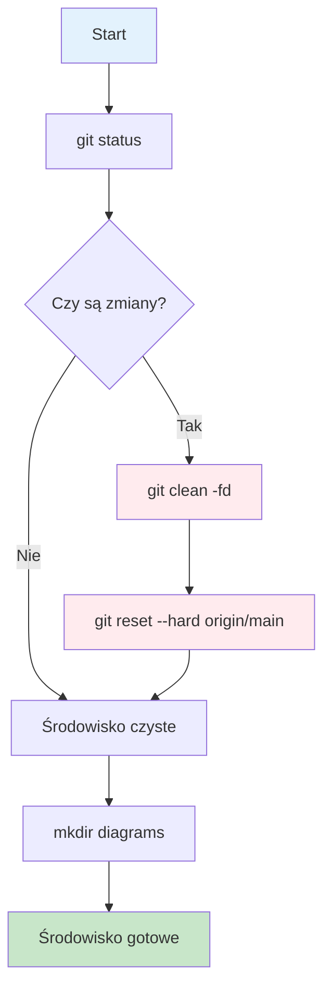

# Etap 1.1: Przygotowanie środowiska

```mermaid
flowchart TD
    A[Start] --> B[git status]
    B --> C{Czy są zmiany?}
    C -->|Tak| D[git clean -fd]
    C -->|Nie| F[Środowisko czyste]
    D --> E[git reset --hard origin/main]
    E --> F
    F --> G[mkdir diagrams]
    G --> H[Środowisko gotowe]
    
    style A fill:#e3f2fd
    style H fill:#c8e6c9
    style D fill:#ffebee
    style E fill:#ffebee
```

**Cel**: Czysty stan repozytorium bez niepotrzebnych zmian