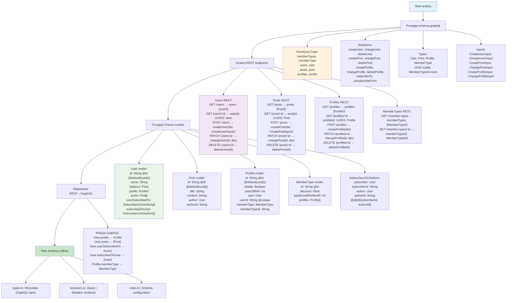

# Etap 1.2: Analiza wymagań

```mermaid
flowchart TD
    A[Start analizy] --> B[Przegląd schema.graphql]
    B --> C[Analiza REST endpoints]
    C --> D[Przegląd Prisma models]
    D --> E[Mapowanie REST→GraphQL]
    E --> F[Plan struktury plików]
    
    B --> B1["RootQueryType:<br/>memberTypes, memberType<br/>users, user<br/>posts, post<br/>profiles, profile"]
    B --> B2["Mutations:<br/>createUser, changeUser, deleteUser<br/>createPost, changePost, deletePost<br/>createProfile, changeProfile, deleteProfile<br/>subscribeTo, unsubscribeFrom"]
    B --> B3["Types:<br/>User, Post, Profile, MemberType<br/>UUID scalar, MemberTypeId enum"]
    B --> B4["Inputs:<br/>CreateUserInput, ChangeUserInput<br/>CreatePostInput, ChangePostInput<br/>CreateProfileInput, ChangeProfileInput"]
    
    C --> C1["Users REST:<br/>GET /users → users: [User!]!<br/>GET /users/:id → user(id: UUID!): User<br/>POST /users → createUser(dto: CreateUserInput!)<br/>PATCH /users/:id → changeUser(id, dto)<br/>DELETE /users/:id → deleteUser(id)"]
    C --> C2["Posts REST:<br/>GET /posts → posts: [Post!]!<br/>GET /posts/:id → post(id: UUID!): Post<br/>POST /posts → createPost(dto: CreatePostInput!)<br/>PATCH /posts/:id → changePost(id, dto)<br/>DELETE /posts/:id → deletePost(id)"]
    C --> C3["Profiles REST:<br/>GET /profiles → profiles: [Profile!]!<br/>GET /profiles/:id → profile(id: UUID!): Profile<br/>POST /profiles → createProfile(dto)<br/>PATCH /profiles/:id → changeProfile(id, dto)<br/>DELETE /profiles/:id → deleteProfile(id)"]
    C --> C4["MemberTypes REST:<br/>GET /member-types → memberTypes: [MemberType!]!<br/>GET /member-types/:id → memberType(id: MemberTypeId!)"]
    
    D --> D1["User model:<br/>id: String @id @default(uuid())<br/>name: String<br/>balance: Float<br/>profile: Profile?<br/>posts: Post[]<br/>userSubscribedTo: SubscribersOnAuthors[]<br/>subscribedToUser: SubscribersOnAuthors[]"]
    D --> D2["Post model:<br/>id: String @id @default(uuid())<br/>title: String<br/>content: String<br/>author: User<br/>authorId: String"]
    D --> D3["Profile model:<br/>id: String @id @default(uuid())<br/>isMale: Boolean<br/>yearOfBirth: Int<br/>user: User<br/>userId: String @unique<br/>memberType: MemberType<br/>memberTypeId: String"]
    D --> D4["MemberType model:<br/>id: String @id<br/>discount: Float<br/>postsLimitPerMonth: Int<br/>profiles: Profile[]"]
    D --> D5["SubscribersOnAuthors:<br/>subscriber: User<br/>subscriberId: String<br/>author: User<br/>authorId: String<br/>@@id([subscriberId, authorId])"]
    
    E --> E1["Relacje GraphQL:<br/>User.profile → Profile<br/>User.posts → [Post]<br/>User.userSubscribedTo → [User]<br/>User.subscribedToUser → [User]<br/>Profile.memberType → MemberType"]
    
    F --> F1["types.ts: Wszystkie GraphQL types"]
    F --> F2["resolvers.ts: Query i Mutation struktura"]
    F --> F3["index.ts: Schema configuration"]
    
    style A fill:#e3f2fd
    style F fill:#c8e6c9
    style B1 fill:#fff3e0
    style C1 fill:#f3e5f5
    style D1 fill:#e8f5e8
```

**Cel**: Szczegółowe zrozumienie wymagań i precyzyjne mapowanie REST → GraphQL