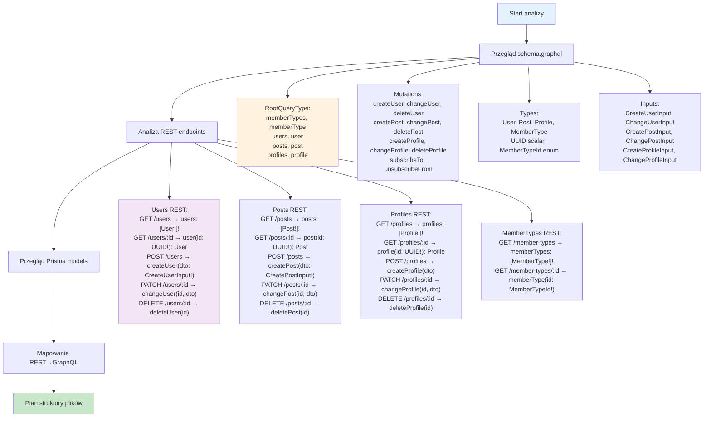

# Etap 1.2: Szczegółowa analiza wymagań

## Szczegółowy opis analizy:

### 1. Przegląd schema.graphql
- **RootQueryType**: 8 queries (memberTypes, memberType, users, user, posts, post, profiles, profile)
- **Mutations**: 11 mutations (3x create, 3x change, 3x delete, 2x subscription)
- **Types**: 4 główne typy obiektów + UUID scalar + enum
- **Inputs**: 6 input types dla operacji create/change

### 2. Mapowanie REST → GraphQL
- **Users**: 5 endpoints REST → 2 queries + 3 mutations
- **Posts**: 5 endpoints REST → 2 queries + 3 mutations  
- **Profiles**: 5 endpoints REST → 2 queries + 3 mutations
- **MemberTypes**: 2 endpoints REST → 2 queries (tylko read)
- **Subscriptions**: Brak REST → 2 mutations GraphQL

### 3. Identyfikacja relacji
- User ↔ Profile (1:1)
- User ↔ Post (1:N)
- Profile ↔ MemberType (N:1)
- User ↔ User (N:N subscriptions)

**Cel**: Precyzyjne zrozumienie wymagań i mapowanie funkcjonalności