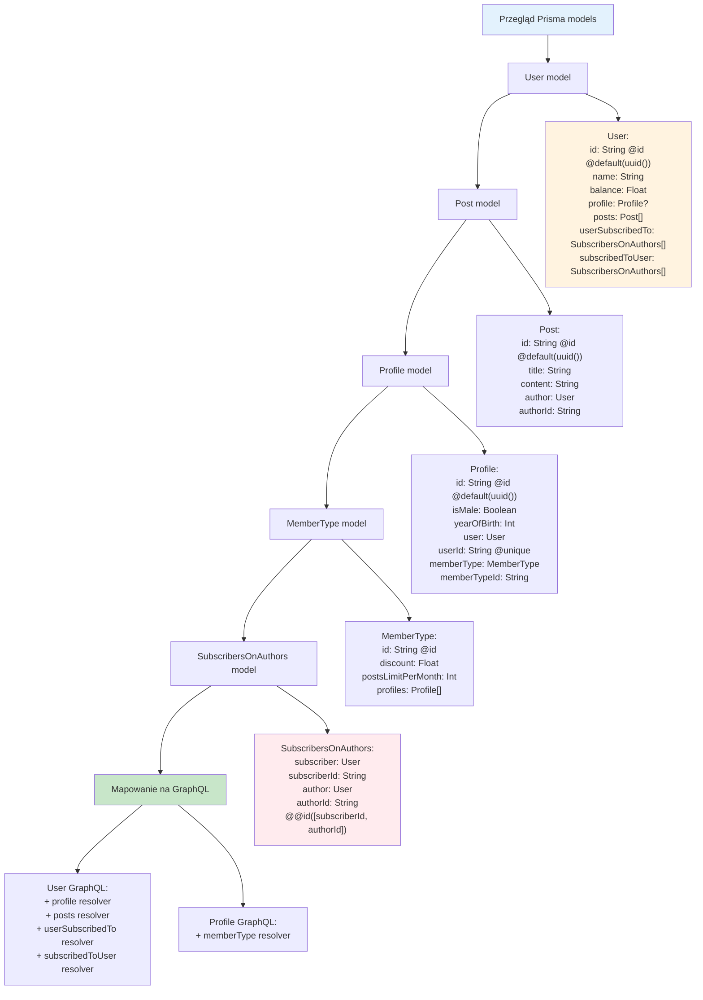

# Etap 1.2b: Analiza modeli Prisma

## Szczegółowy opis modeli:

### 1. User model
- **Pola podstawowe**: id (UUID), name, balance
- **Relacje**: profile (1:1), posts (1:N), subscriptions (N:N)
- **GraphQL impact**: Wymaga 4 resolverów dla relacji

### 2. Post model  
- **Pola podstawowe**: id (UUID), title, content
- **Relacje**: author (N:1 z User)
- **GraphQL impact**: Prosty typ bez dodatkowych resolverów

### 3. Profile model
- **Pola podstawowe**: id (UUID), isMale, yearOfBirth
- **Relacje**: user (1:1), memberType (N:1)
- **GraphQL impact**: Wymaga resolver dla memberType

### 4. MemberType model
- **Pola podstawowe**: id (String), discount, postsLimitPerMonth
- **Relacje**: profiles (1:N)
- **GraphQL impact**: Prosty typ bez dodatkowych resolverów

### 5. SubscribersOnAuthors (junction table)
- **Pola**: subscriberId, authorId (composite key)
- **Relacje**: subscriber (User), author (User)
- **GraphQL impact**: Ukryte - używane w User resolverach

**Cel**: Zrozumienie struktury danych i wymaganych resolverów