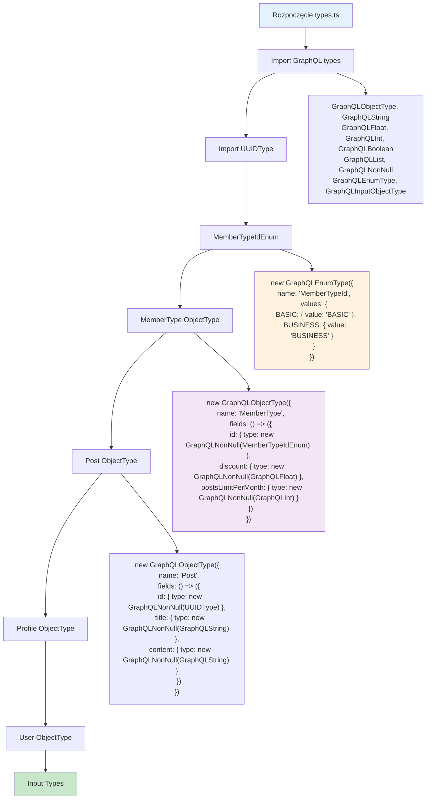

# Etap 1.3: Szczegółowe utworzenie types.ts

## Szczegółowy opis implementacji:

### 1. Imports
- **GraphQL core types**: ObjectType, String, Float, Int, Boolean
- **GraphQL modifiers**: List, NonNull  
- **GraphQL special**: EnumType, InputObjectType
- **Custom types**: UUIDType z ./types/uuid.js

### 2. MemberTypeIdEnum
- **Typ**: GraphQLEnumType
- **Wartości**: BASIC: 'BASIC', BUSINESS: 'BUSINESS'
- **Użycie**: W Profile.memberTypeId i queries

### 3. Object Types
- **MemberType**: 3 pola (id, discount, postsLimitPerMonth)
- **Post**: 3 pola (id, title, content)  
- **Profile**: 4 pola (id, isMale, yearOfBirth, memberType)
- **User**: 6 pól (id, name, balance, profile, posts, subscriptions)

### 4. Kluczowe cechy
- **NonNull wrapping**: Wszystkie wymagane pola
- **List wrapping**: Arrays dla posts i subscriptions
- **Lazy fields**: () => ({}) dla circular references
- **No resolvers**: Tylko struktura typów

**Cel**: Kompletna definicja typów GraphQL zgodna ze schematem