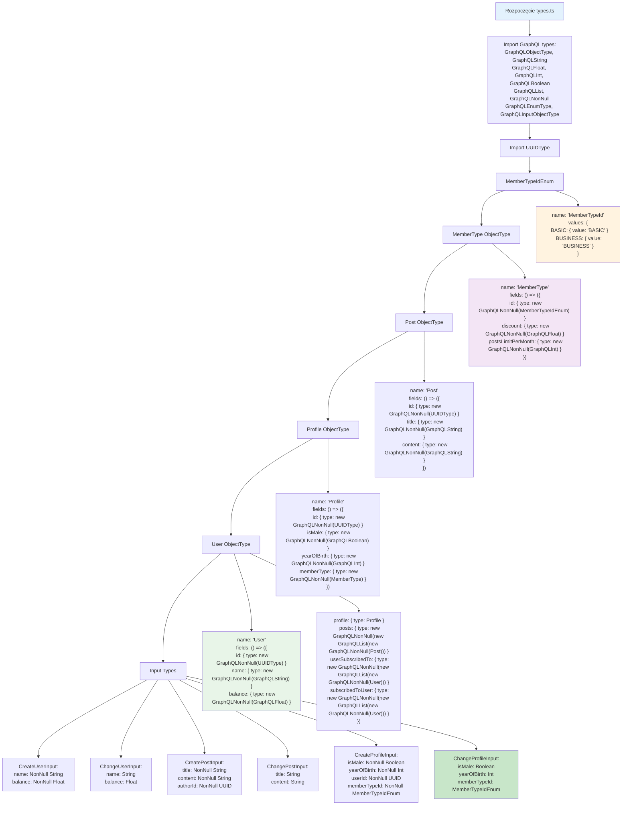

# Etap 1.3: Utworzenie types.ts

```mermaid
flowchart TD
    A[Rozpoczęcie types.ts] --> B["Import GraphQL types:<br/>GraphQLObjectType, GraphQLString<br/>GraphQLFloat, GraphQLInt, GraphQLBoolean<br/>GraphQLList, GraphQLNonNull<br/>GraphQLEnumType, GraphQLInputObjectType"]
    B --> C[Import UUIDType]
    C --> D[MemberTypeIdEnum]
    D --> E[MemberType ObjectType]
    E --> F[Post ObjectType]
    F --> G[Profile ObjectType]
    G --> H[User ObjectType]
    H --> I[Input Types]
    
    D --> D1["name: 'MemberTypeId'<br/>values: {<br/>  BASIC: { value: 'BASIC' }<br/>  BUSINESS: { value: 'BUSINESS' }<br/>}"]
    
    E --> E1["name: 'MemberType'<br/>fields: () => ({<br/>  id: { type: new GraphQLNonNull(MemberTypeIdEnum) }<br/>  discount: { type: new GraphQLNonNull(GraphQLFloat) }<br/>  postsLimitPerMonth: { type: new GraphQLNonNull(GraphQLInt) }<br/>})"]
    
    F --> F1["name: 'Post'<br/>fields: () => ({<br/>  id: { type: new GraphQLNonNull(UUIDType) }<br/>  title: { type: new GraphQLNonNull(GraphQLString) }<br/>  content: { type: new GraphQLNonNull(GraphQLString) }<br/>})"]
    
    G --> G1["name: 'Profile'<br/>fields: () => ({<br/>  id: { type: new GraphQLNonNull(UUIDType) }<br/>  isMale: { type: new GraphQLNonNull(GraphQLBoolean) }<br/>  yearOfBirth: { type: new GraphQLNonNull(GraphQLInt) }<br/>  memberType: { type: new GraphQLNonNull(MemberType) }<br/>})"]
    
    H --> H1["name: 'User'<br/>fields: () => ({<br/>  id: { type: new GraphQLNonNull(UUIDType) }<br/>  name: { type: new GraphQLNonNull(GraphQLString) }<br/>  balance: { type: new GraphQLNonNull(GraphQLFloat) }"]
    H --> H2["  profile: { type: Profile }<br/>  posts: { type: new GraphQLNonNull(new GraphQLList(new GraphQLNonNull(Post))) }<br/>  userSubscribedTo: { type: new GraphQLNonNull(new GraphQLList(new GraphQLNonNull(User))) }<br/>  subscribedToUser: { type: new GraphQLNonNull(new GraphQLList(new GraphQLNonNull(User))) }<br/>})"]
    
    I --> I1["CreateUserInput:<br/>name: NonNull String<br/>balance: NonNull Float"]
    I --> I2["ChangeUserInput:<br/>name: String<br/>balance: Float"]
    I --> I3["CreatePostInput:<br/>title: NonNull String<br/>content: NonNull String<br/>authorId: NonNull UUID"]
    I --> I4["ChangePostInput:<br/>title: String<br/>content: String"]
    I --> I5["CreateProfileInput:<br/>isMale: NonNull Boolean<br/>yearOfBirth: NonNull Int<br/>userId: NonNull UUID<br/>memberTypeId: NonNull MemberTypeIdEnum"]
    I --> I6["ChangeProfileInput:<br/>isMale: Boolean<br/>yearOfBirth: Int<br/>memberTypeId: MemberTypeIdEnum"]
    
    style A fill:#e3f2fd
    style I6 fill:#c8e6c9
    style D1 fill:#fff3e0
    style E1 fill:#f3e5f5
    style H1 fill:#e8f5e8
```

**Cel**: Precyzyjna definicja wszystkich typów GraphQL z pełną specyfikacją pól