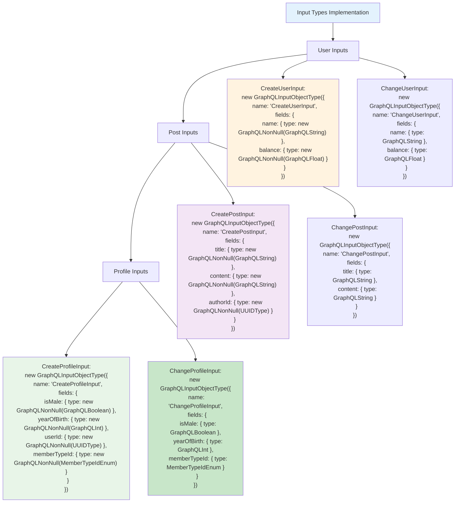

# Etap 1.3b: Szczegółowe Input Types

## Szczegółowy opis Input Types:

### 1. User Input Types
- **CreateUserInput**: name (required), balance (required)
- **ChangeUserInput**: name (optional), balance (optional)
- **Logika**: Create wymaga wszystkich pól, Change - opcjonalne

### 2. Post Input Types  
- **CreatePostInput**: title (required), content (required), authorId (required)
- **ChangePostInput**: title (optional), content (optional)
- **Logika**: authorId tylko przy tworzeniu, nie można zmieniać

### 3. Profile Input Types
- **CreateProfileInput**: wszystkie pola wymagane (isMale, yearOfBirth, userId, memberTypeId)
- **ChangeProfileInput**: wszystkie pola opcjonalne oprócz userId (nie można zmieniać)
- **Logika**: userId tylko przy tworzeniu, reszta można zmieniać

### 4. Kluczowe wzorce
- **Create inputs**: Wszystkie pola NonNull
- **Change inputs**: Pola opcjonalne (bez NonNull)
- **ID fields**: Tylko w Create, nie w Change
- **Type consistency**: Zgodność z Object Types

**Cel**: Precyzyjne input types dla wszystkich mutations