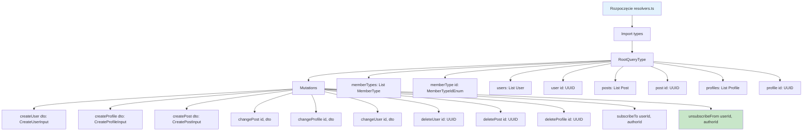

# Etap 1.4: Przygotowanie struktury resolvers.ts

```mermaid
flowchart TD
    A[Rozpoczęcie resolvers.ts] --> B[Import types]
    B --> C[RootQueryType]
    C --> D[Mutations]
    
    C --> C1[memberTypes: List MemberType]
    C --> C2[memberType id: MemberTypeIdEnum]
    C --> C3[users: List User]
    C --> C4[user id: UUID]
    C --> C5[posts: List Post]
    C --> C6[post id: UUID]
    C --> C7[profiles: List Profile]
    C --> C8[profile id: UUID]
    
    D --> D1[createUser dto: CreateUserInput]
    D --> D2[createProfile dto: CreateProfileInput]
    D --> D3[createPost dto: CreatePostInput]
    D --> D4[changePost id, dto]
    D --> D5[changeProfile id, dto]
    D --> D6[changeUser id, dto]
    D --> D7[deleteUser id: UUID]
    D --> D8[deletePost id: UUID]
    D --> D9[deleteProfile id: UUID]
    D --> D10[subscribeTo userId, authorId]
    D --> D11[unsubscribeFrom userId, authorId]
    
    style A fill:#e3f2fd
    style D11 fill:#c8e6c9
```

**Cel**: Struktura wszystkich resolverów bez implementacji