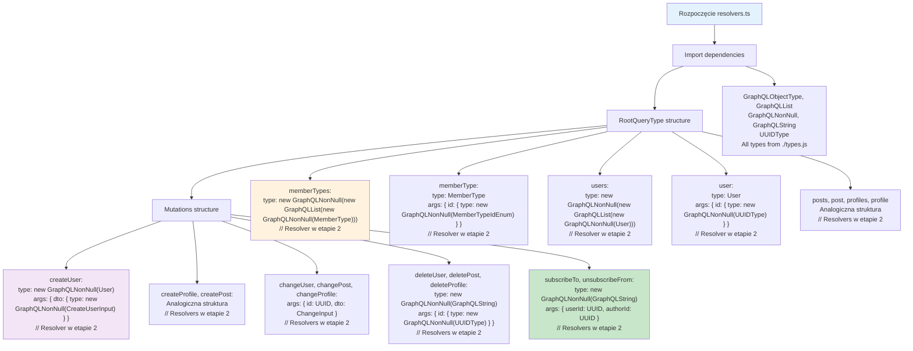

# Etap 1.4: Szczegółowa struktura resolvers.ts

## Szczegółowy opis struktury resolvers:

### 1. RootQueryType (8 queries)
- **memberTypes**: Lista wszystkich typów członkostwa
- **memberType(id)**: Pojedynczy typ członkostwa po ID
- **users**: Lista wszystkich użytkowników  
- **user(id)**: Pojedynczy użytkownik po ID
- **posts**: Lista wszystkich postów
- **post(id)**: Pojedynczy post po ID
- **profiles**: Lista wszystkich profili
- **profile(id)**: Pojedynczy profil po ID

### 2. Mutations (11 mutations)
- **Create (3)**: createUser, createProfile, createPost
- **Change (3)**: changeUser, changeProfile, changePost  
- **Delete (3)**: deleteUser, deleteProfile, deletePost
- **Subscriptions (2)**: subscribeTo, unsubscribeFrom

### 3. Wzorce argumentów
- **List queries**: Bez argumentów
- **Single queries**: args: { id: NonNull UUID/MemberTypeId }
- **Create mutations**: args: { dto: NonNull CreateInput }
- **Change mutations**: args: { id: NonNull UUID, dto: NonNull ChangeInput }
- **Delete mutations**: args: { id: NonNull UUID }
- **Subscription mutations**: args: { userId: NonNull UUID, authorId: NonNull UUID }

### 4. Typy zwracane
- **List queries**: NonNull List NonNull Type
- **Single queries**: Nullable Type
- **Create/Change mutations**: NonNull Type
- **Delete/Subscription mutations**: NonNull String

**Cel**: Kompletna struktura resolvers gotowa na implementację