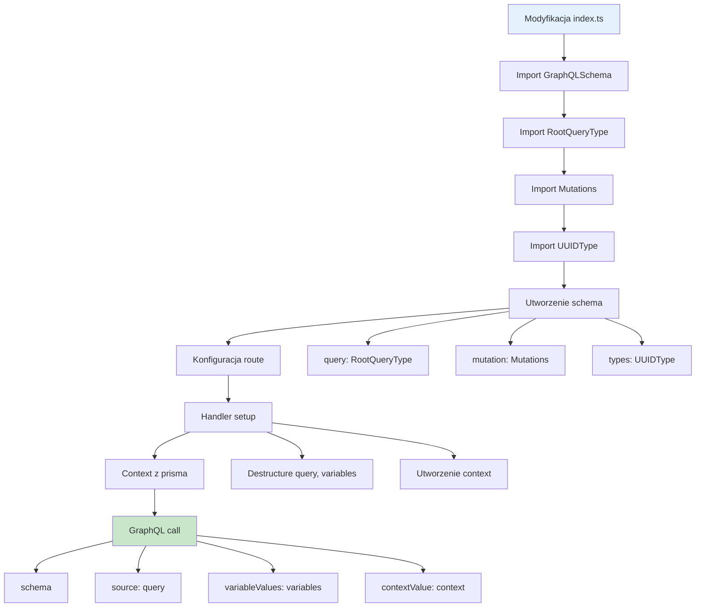

# Etap 1.5: Konfiguracja GraphQL Schema w index.ts

```mermaid
flowchart TD
    A[Modyfikacja index.ts] --> B[Import GraphQLSchema]
    B --> C[Import RootQueryType]
    C --> D[Import Mutations]
    D --> E[Import UUIDType]
    E --> F[Utworzenie schema]
    F --> G[Konfiguracja route]
    G --> H[Handler setup]
    H --> I[Context z prisma]
    I --> J[GraphQL call]
    
    F --> F1[query: RootQueryType]
    F --> F2[mutation: Mutations]
    F --> F3[types: UUIDType]
    
    H --> H1[Destructure query, variables]
    H --> H2[Utworzenie context]
    
    J --> J1[schema]
    J --> J2[source: query]
    J --> J3[variableValues: variables]
    J --> J4[contextValue: context]
    
    style A fill:#e3f2fd
    style J fill:#c8e6c9
```

**Cel**: Połączenie wszystkich elementów w działający GraphQL endpoint