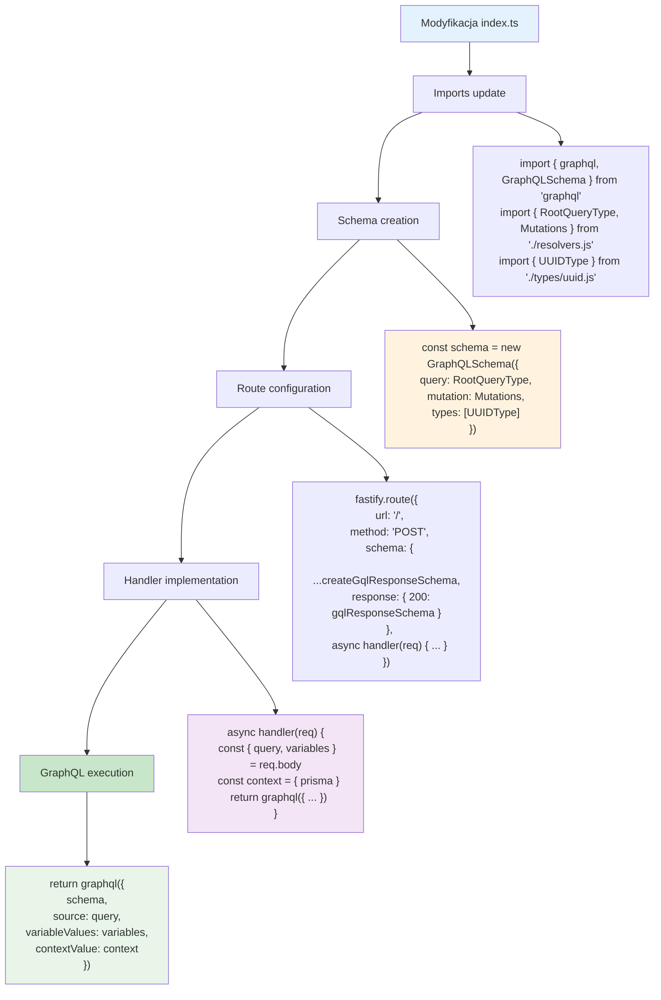

# Etap 1.5: Szczegółowa konfiguracja GraphQL Schema

## Szczegółowy opis konfiguracji:

### 1. Imports update
- **GraphQLSchema**: Do utworzenia schema
- **RootQueryType, Mutations**: Z ./resolvers.js
- **UUIDType**: Custom scalar type
- **graphql**: Execution function

### 2. Schema creation
- **query**: RootQueryType (8 queries)
- **mutation**: Mutations (11 mutations)  
- **types**: [UUIDType] - custom scalars
- **Brak subscription**: Nie wymagane w zadaniu

### 3. Route configuration
- **URL**: '/' (POST /graphql)
- **Method**: POST
- **Schema**: Fastify validation schemas
- **Handler**: Async function

### 4. Handler implementation
- **Input**: Destructure query, variables z req.body
- **Context**: { prisma } - dostęp do bazy danych
- **Output**: Wynik graphql() execution

### 5. GraphQL execution
- **schema**: Utworzona GraphQL schema
- **source**: Query string z request
- **variableValues**: Variables z request
- **contextValue**: Context z prisma
- **Brak validationRules**: Dodane w etapie 3

### 6. Stan po etapie 1
- **Schema**: Kompletna struktura
- **Resolvers**: Zdefiniowane ale nie zaimplementowane
- **Endpoint**: Gotowy do obsługi requests
- **Context**: Prisma dostępna w resolvers

**Cel**: Działający GraphQL endpoint z kompletną strukturą