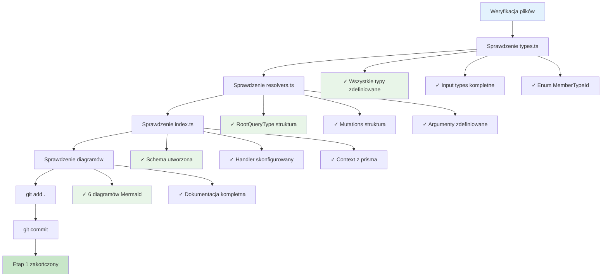

# Etap 1.6: Przygotowanie do commit

```mermaid
flowchart TD
    A[Weryfikacja plików] --> B[Sprawdzenie types.ts]
    B --> C[Sprawdzenie resolvers.ts]
    C --> D[Sprawdzenie index.ts]
    D --> E[Sprawdzenie diagramów]
    E --> F[git add .]
    F --> G[git commit]
    G --> H[Etap 1 zakończony]
    
    B --> B1[✓ Wszystkie typy zdefiniowane]
    B --> B2[✓ Input types kompletne]
    B --> B3[✓ Enum MemberTypeId]
    
    C --> C1[✓ RootQueryType struktura]
    C --> C2[✓ Mutations struktura]
    C --> C3[✓ Argumenty zdefiniowane]
    
    D --> D1[✓ Schema utworzona]
    D --> D2[✓ Handler skonfigurowany]
    D --> D3[✓ Context z prisma]
    
    E --> E1[✓ 6 diagramów Mermaid]
    E --> E2[✓ Dokumentacja kompletna]
    
    style A fill:#e3f2fd
    style H fill:#c8e6c9
    style B1 fill:#e8f5e8
    style C1 fill:#e8f5e8
    style D1 fill:#e8f5e8
    style E1 fill:#e8f5e8
```

**Cel**: Weryfikacja i commit kompletnego Etapu 1