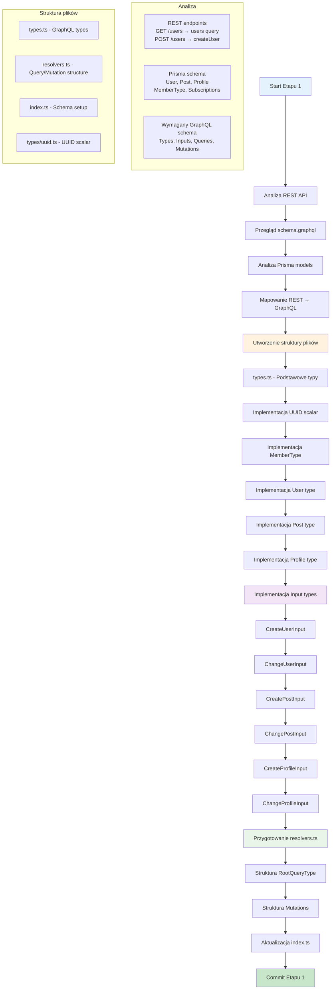

# Etap 1: Analiza projektu i przygotowanie podstawowej struktury GraphQL

## Mapowanie REST → GraphQL:

### REST Endpoints → GraphQL Queries:
- `GET /users` → `users: [User!]!`
- `GET /users/:id` → `user(id: UUID!): User`
- `GET /posts` → `posts: [Post!]!`
- `GET /posts/:id` → `post(id: UUID!): Post`
- `GET /profiles` → `profiles: [Profile!]!`
- `GET /profiles/:id` → `profile(id: UUID!): Profile`
- `GET /member-types` → `memberTypes: [MemberType!]!`
- `GET /member-types/:id` → `memberType(id: MemberTypeId!): MemberType`

### REST Endpoints → GraphQL Mutations:
- `POST /users` → `createUser(dto: CreateUserInput!): User!`
- `PATCH /users/:id` → `changeUser(id: UUID!, dto: ChangeUserInput!): User!`
- `DELETE /users/:id` → `deleteUser(id: UUID!): String!`
- `POST /posts` → `createPost(dto: CreatePostInput!): Post!`
- `PATCH /posts/:id` → `changePost(id: UUID!, dto: ChangePostInput!): Post!`
- `DELETE /posts/:id` → `deletePost(id: UUID!): String!`
- `POST /profiles` → `createProfile(dto: CreateProfileInput!): Profile!`
- `PATCH /profiles/:id` → `changeProfile(id: UUID!, dto: ChangeProfileInput!): Profile!`
- `DELETE /profiles/:id` → `deleteProfile(id: UUID!): String!`

### Dodatkowe mutations (subscriptions):
- `subscribeTo(userId: UUID!, authorId: UUID!): String!`
- `unsubscribeFrom(userId: UUID!, authorId: UUID!): String!`

## Cel Etapu 1:
Utworzenie kompletnej struktury typów GraphQL zgodnej ze schematem, bez implementacji resolverów. Przygotowanie fundamentu dla kolejnych etapów.