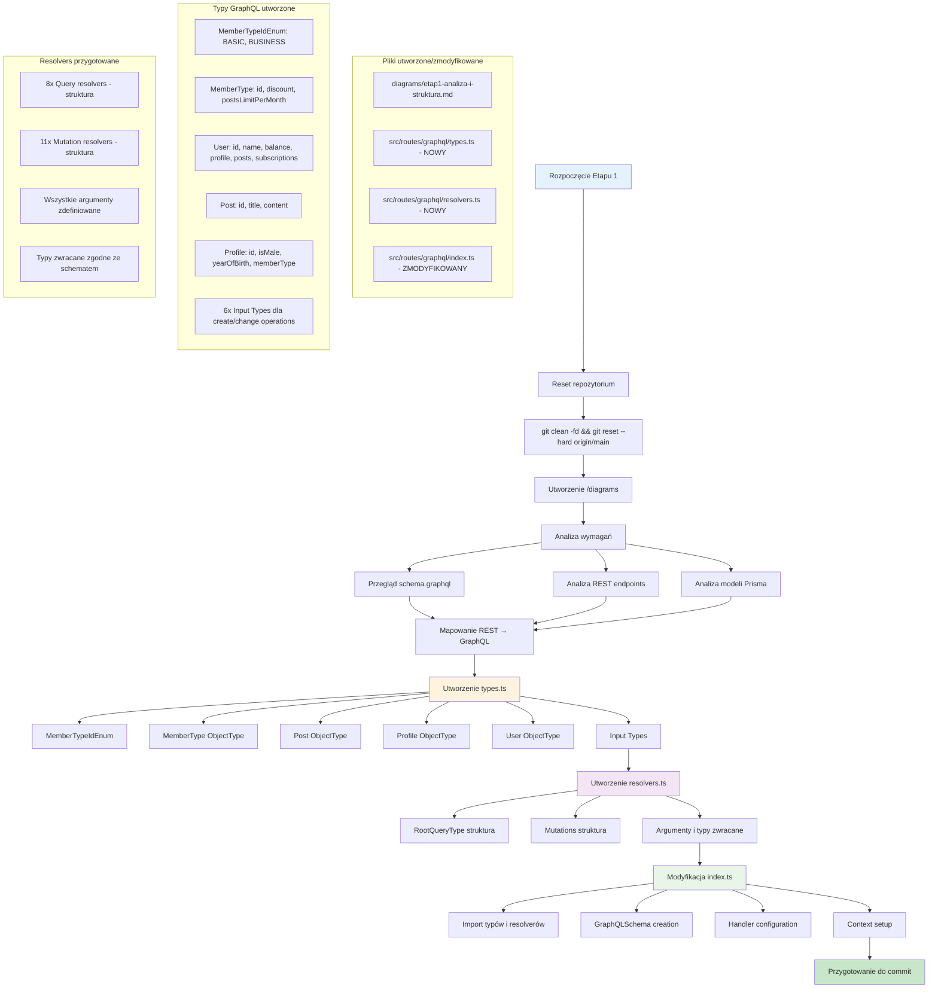

# Etap 1: Szczegółowe działania - Analiza i struktura GraphQL



## Stan po Etapie 1:

### ✅ Zrealizowane:
1. **Kompletna struktura typów GraphQL** - wszystkie typy zgodne ze schematem
2. **Przygotowana struktura resolverów** - wszystkie queries i mutations zdefiniowane
3. **Skonfigurowany GraphQL Schema** - gotowy do dodania resolverów
4. **Czysty kod** - bez implementacji, tylko struktura
5. **Dokumentacja** - diagramy Mermaid opisujące proces

### 🔄 Do zrobienia w następnych etapach:
1. **Etap 2**: Implementacja resolverów (queries i mutations)
2. **Etap 3**: Dodanie depth limit (graphql-depth-limit)
3. **Etap 4**: Implementacja DataLoader dla N+1 problem
4. **Etap 5**: Cache priming i optymalizacje

### 📁 Struktura plików:
```
src/routes/graphql/
├── types/
│   └── uuid.ts (istniejący)
├── index.ts (zmodyfikowany)
├── schemas.ts (istniejący)
├── types.ts (nowy)
└── resolvers.ts (nowy)

diagrams/
├── etap1-analiza-i-struktura.md
└── etap1-szczegolowe-dzialania.md
```

### 🎯 Kluczowe osiągnięcia:
- **Zgodność ze schematem**: Wszystkie typy odpowiadają wymaganiom
- **Modularność**: Podział na logiczne pliki (types, resolvers)
- **Przygotowanie**: Struktura gotowa na implementację resolverów
- **Dokumentacja**: Szczegółowe diagramy procesu