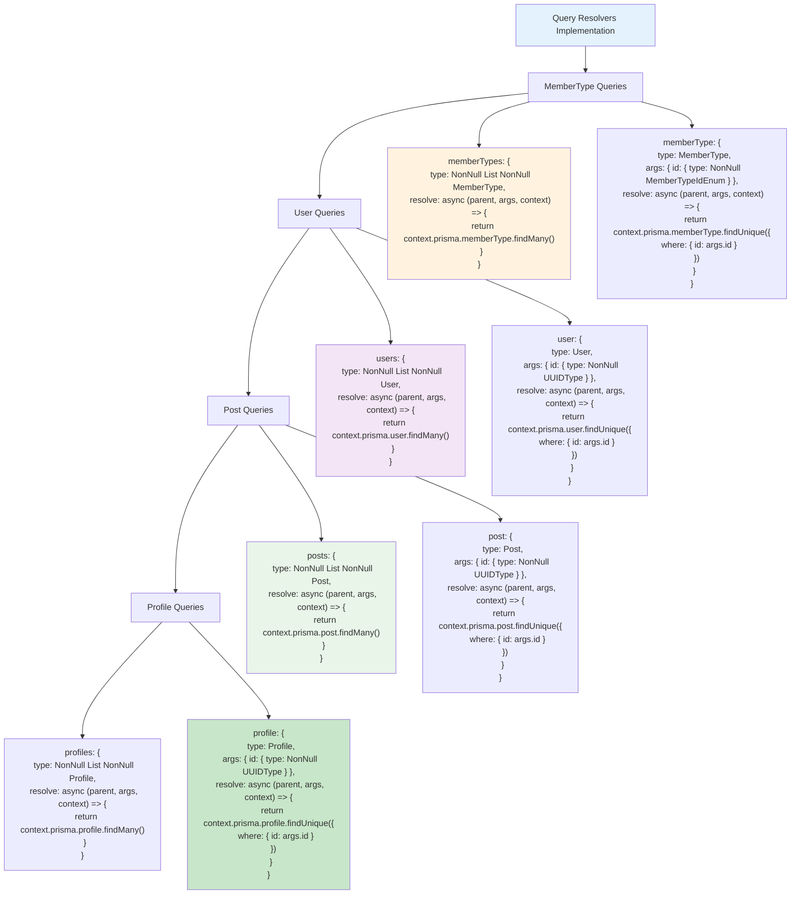

# Etap 2.1: Implementacja Query Resolvers

## Szczegółowy opis Query Resolvers:

### 1. MemberType Queries
- **memberTypes**: Zwraca wszystkie typy członkostwa z bazy
- **memberType(id)**: Zwraca konkretny typ członkostwa po ID
- **Prisma calls**: `findMany()`, `findUnique({ where: { id } })`

### 2. User Queries  
- **users**: Zwraca wszystkich użytkowników
- **user(id)**: Zwraca konkretnego użytkownika po UUID
- **Prisma calls**: `findMany()`, `findUnique({ where: { id } })`

### 3. Post Queries
- **posts**: Zwraca wszystkie posty
- **post(id)**: Zwraca konkretny post po UUID
- **Prisma calls**: `findMany()`, `findUnique({ where: { id } })`

### 4. Profile Queries
- **profiles**: Zwraca wszystkie profile
- **profile(id)**: Zwraca konkretny profil po UUID
- **Prisma calls**: `findMany()`, `findUnique({ where: { id } })`

### 5. Wzorce implementacji
- **List queries**: Bez argumentów, `findMany()`
- **Single queries**: Argument `id`, `findUnique({ where: { id } })`
- **Return types**: List queries → NonNull List, Single → Nullable
- **Context usage**: `context.prisma` dla dostępu do bazy

**Cel**: Podstawowe CRUD read operations dla wszystkich typów