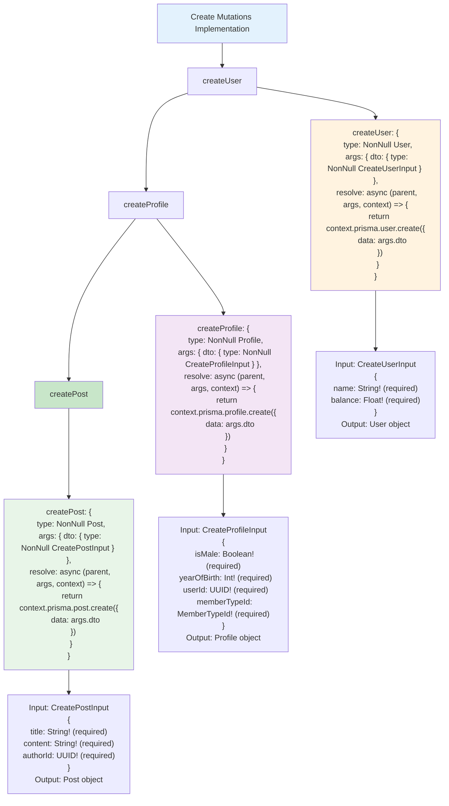

# Etap 2.2: Implementacja Create Mutations

## Szczegółowy opis Create Mutations:

### 1. createUser
- **Input**: `CreateUserInput` (name, balance - oba wymagane)
- **Prisma call**: `prisma.user.create({ data: args.dto })`
- **Output**: Nowo utworzony User object
- **Walidacja**: Prisma schema validation

### 2. createProfile
- **Input**: `CreateProfileInput` (isMale, yearOfBirth, userId, memberTypeId - wszystkie wymagane)
- **Prisma call**: `prisma.profile.create({ data: args.dto })`
- **Output**: Nowo utworzony Profile object
- **Constraints**: userId musi być unique, memberTypeId musi istnieć

### 3. createPost
- **Input**: `CreatePostInput` (title, content, authorId - wszystkie wymagane)
- **Prisma call**: `prisma.post.create({ data: args.dto })`
- **Output**: Nowo utworzony Post object
- **Constraints**: authorId musi istnieć (foreign key)

### 4. Wzorce implementacji
- **Argument pattern**: `{ dto: { type: NonNull CreateInput } }`
- **Prisma pattern**: `prisma.model.create({ data: args.dto })`
- **Return type**: `NonNull ModelType`
- **Error handling**: Prisma automatycznie rzuca błędy dla constraint violations

### 5. Potencjalne błędy
- **Unique constraint**: userId w Profile
- **Foreign key**: authorId w Post, memberTypeId w Profile
- **Required fields**: Wszystkie pola w CreateInput są wymagane

**Cel**: Implementacja tworzenia nowych rekordów z proper validation