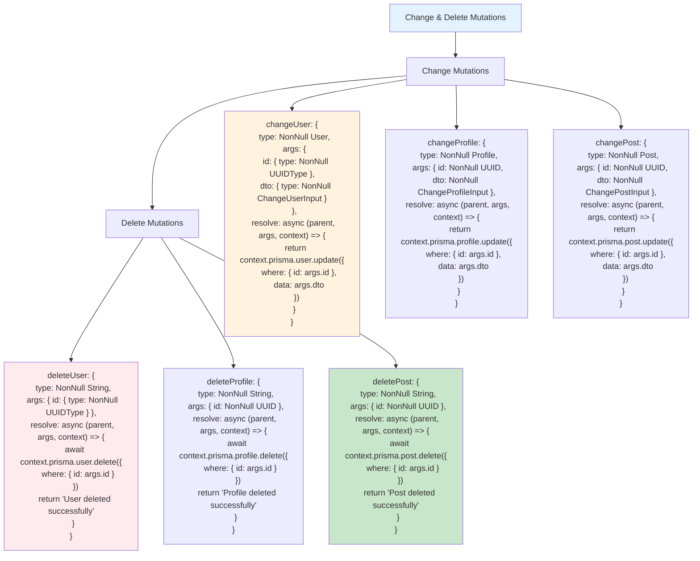

# Etap 2.3: Implementacja Change i Delete Mutations

## Szczegółowy opis Change & Delete Mutations:

### 1. Change Mutations (3)
- **changeUser**: Aktualizuje name i/lub balance
- **changeProfile**: Aktualizuje isMale, yearOfBirth i/lub memberTypeId
- **changePost**: Aktualizuje title i/lub content

#### Wzorzec Change:
- **Args**: `{ id: NonNull UUID, dto: NonNull ChangeInput }`
- **Prisma**: `prisma.model.update({ where: { id }, data: dto })`
- **Return**: NonNull ModelType (zaktualizowany obiekt)
- **Input fields**: Wszystkie opcjonalne (partial update)

### 2. Delete Mutations (3)
- **deleteUser**: Usuwa użytkownika po ID
- **deleteProfile**: Usuwa profil po ID  
- **deletePost**: Usuwa post po ID

#### Wzorzec Delete:
- **Args**: `{ id: NonNull UUID }`
- **Prisma**: `prisma.model.delete({ where: { id } })`
- **Return**: NonNull String (success message)
- **Cascade**: Prisma schema definiuje cascade behavior

### 3. Input Types dla Change
- **ChangeUserInput**: `{ name?: String, balance?: Float }`
- **ChangeProfileInput**: `{ isMale?: Boolean, yearOfBirth?: Int, memberTypeId?: MemberTypeId }`
- **ChangePostInput**: `{ title?: String, content?: String }`

### 4. Error Handling
- **Not found**: Prisma rzuca błąd jeśli ID nie istnieje
- **Constraint violations**: Foreign key, unique constraints
- **Cascade deletes**: User deletion → Profile/Posts deletion (jeśli skonfigurowane)

### 5. Return Values
- **Change mutations**: Zwracają zaktualizowany obiekt
- **Delete mutations**: Zwracają success message string
- **Consistency**: Zgodne z wymaganiami schema.graphql

**Cel**: Kompletne CRUD operations (Update, Delete) z proper error handling