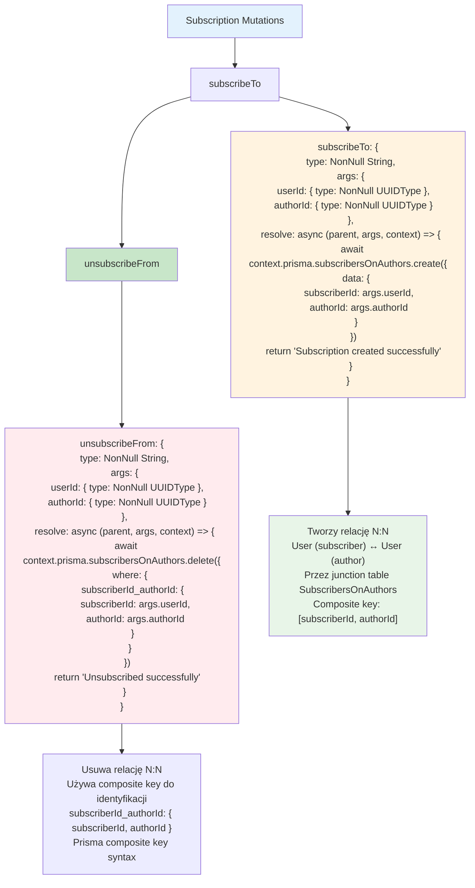

# Etap 2.4: Implementacja Subscription Mutations



## Szczegółowy opis Subscription Mutations:

### 1. subscribeTo Mutation
- **Purpose**: Tworzy subscription relationship między użytkownikami
- **Args**: `userId` (subscriber), `authorId` (author to follow)
- **Prisma call**: `subscribersOnAuthors.create()`
- **Data**: `{ subscriberId: userId, authorId: authorId }`
- **Return**: Success message string

### 2. unsubscribeFrom Mutation  
- **Purpose**: Usuwa subscription relationship
- **Args**: `userId` (subscriber), `authorId` (author to unfollow)
- **Prisma call**: `subscribersOnAuthors.delete()`
- **Where**: Composite key `subscriberId_authorId`
- **Return**: Success message string

### 3. SubscribersOnAuthors Model
```prisma
model SubscribersOnAuthors {
  subscriber   User   @relation("subscriber", fields: [subscriberId], references: [id])
  subscriberId String
  author       User   @relation("author", fields: [authorId], references: [id])
  authorId     String
  
  @@id([subscriberId, authorId])
}
```

### 4. Relacje w User Model
```prisma
model User {
  userSubscribedTo SubscribersOnAuthors[] @relation("subscriber")
  subscribedToUser SubscribersOnAuthors[] @relation("author")
}
```

### 5. Kluczowe aspekty
- **Junction table**: SubscribersOnAuthors łączy Users
- **Composite key**: `[subscriberId, authorId]` zapobiega duplikatom
- **Bidirectional**: User może być subscriber i author
- **Cascade**: `onDelete: Cascade` usuwa subscriptions gdy User jest usunięty

### 6. Error Handling
- **Duplicate subscription**: Prisma rzuca błąd unique constraint
- **Non-existent users**: Foreign key constraint violation
- **Self-subscription**: Możliwe (nie ma ograniczenia)
- **Already unsubscribed**: Prisma rzuca błąd record not found

### 7. GraphQL Schema Mapping
- **User.userSubscribedTo**: Authors które user followuje
- **User.subscribedToUser**: Subscribers którzy followują user
- **Resolvers**: Będą dodane w następnym kroku

**Cel**: Implementacja follow/unfollow functionality między użytkownikami