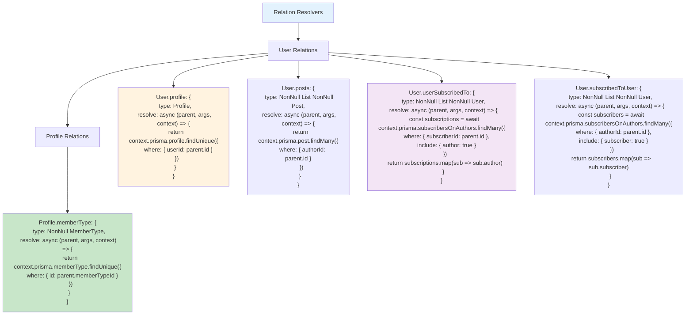

# Etap 2.5: Implementacja Relation Resolvers

## Szczegółowy opis Relation Resolvers:

### 1. User.profile Resolver
- **Relacja**: User 1:1 Profile (optional)
- **Logic**: Znajdź Profile gdzie `userId = parent.id`
- **Prisma**: `profile.findUnique({ where: { userId: parent.id } })`
- **Return**: Profile | null

### 2. User.posts Resolver
- **Relacja**: User 1:N Post
- **Logic**: Znajdź wszystkie Posts gdzie `authorId = parent.id`
- **Prisma**: `post.findMany({ where: { authorId: parent.id } })`
- **Return**: Post[] (zawsze array, może być pusty)

### 3. User.userSubscribedTo Resolver
- **Relacja**: User N:N User (authors które user followuje)
- **Logic**: 
  1. Znajdź SubscribersOnAuthors gdzie `subscriberId = parent.id`
  2. Include author data
  3. Map do array of Users
- **Prisma**: `subscribersOnAuthors.findMany({ where: { subscriberId }, include: { author: true } })`
- **Return**: User[] (authors)

### 4. User.subscribedToUser Resolver
- **Relacja**: User N:N User (subscribers którzy followują user)
- **Logic**:
  1. Znajdź SubscribersOnAuthors gdzie `authorId = parent.id`
  2. Include subscriber data  
  3. Map do array of Users
- **Prisma**: `subscribersOnAuthors.findMany({ where: { authorId }, include: { subscriber: true } })`
- **Return**: User[] (subscribers)

### 5. Profile.memberType Resolver
- **Relacja**: Profile N:1 MemberType
- **Logic**: Znajdź MemberType gdzie `id = parent.memberTypeId`
- **Prisma**: `memberType.findUnique({ where: { id: parent.memberTypeId } })`
- **Return**: MemberType (zawsze istnieje przez foreign key)

### 6. Kluczowe wzorce
- **Parent object**: `parent` zawiera dane z parent query
- **Foreign key access**: `parent.userId`, `parent.authorId`, etc.
- **Include pattern**: Dla junction tables używamy `include`
- **Mapping**: Transform junction records do target objects

### 7. Performance considerations
- **N+1 problem**: Każdy User w liście triggeruje osobne queries
- **Solution**: DataLoader (Etap 4)
- **Current**: Proste resolvers bez optymalizacji

**Cel**: Kompletne relacje między typami GraphQL zgodne z Prisma schema