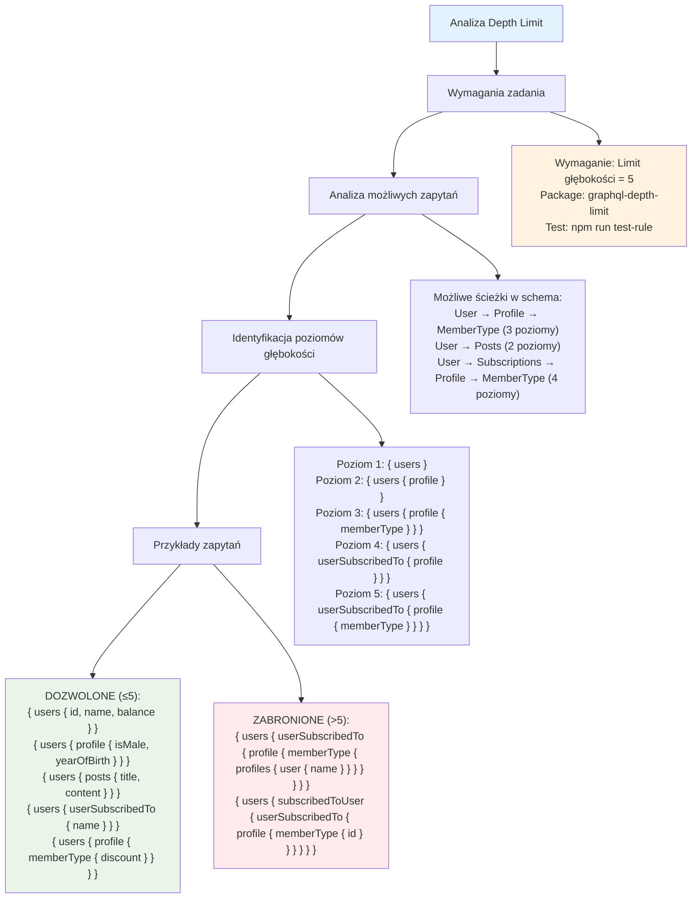

# Etap 3.1: Analiza wymagań Depth Limit



## Szczegółowa analiza poziomów głębokości:

### 1. Struktura relacji GraphQL
```
User (1)
├── profile (2)
│   └── memberType (3)
│       └── profiles (4)
│           └── user (5)
│               ├── posts (6) ❌
│               └── profile (6) ❌
├── posts (2)
├── userSubscribedTo (2)
│   ├── profile (3)
│   │   └── memberType (4)
│   │       └── profiles (5)
│   │           └── user (6) ❌
│   └── posts (3)
└── subscribedToUser (2)
    └── [same as userSubscribedTo]
```

### 2. Przykłady zapytań według poziomów:

**Poziom 1:**
```graphql
{ users { id } }
{ posts { title } }
```

**Poziom 2:**
```graphql
{ users { profile { id } } }
{ users { posts { title } } }
```

**Poziom 3:**
```graphql
{ users { profile { memberType { id } } } }
{ users { userSubscribedTo { name } } }
```

**Poziom 4:**
```graphql
{ users { userSubscribedTo { profile { isMale } } } }
```

**Poziom 5 (maksymalny dozwolony):**
```graphql
{ users { userSubscribedTo { profile { memberType { discount } } } } }
```

**Poziom 6+ (zabronione):**
```graphql
{ users { userSubscribedTo { profile { memberType { profiles { id } } } } } }
```

### 3. Kluczowe obserwacje:
- **Najgłębsza ścieżka**: User → userSubscribedTo → profile → memberType → profiles (5 poziomów)
- **Cykliczne relacje**: User ↔ User przez subscriptions
- **Potencjał przekroczenia**: Łatwo przekroczyć limit przez cykliczne relacje

**Cel**: Zrozumienie struktury zapytań i identyfikacja przypadków testowych