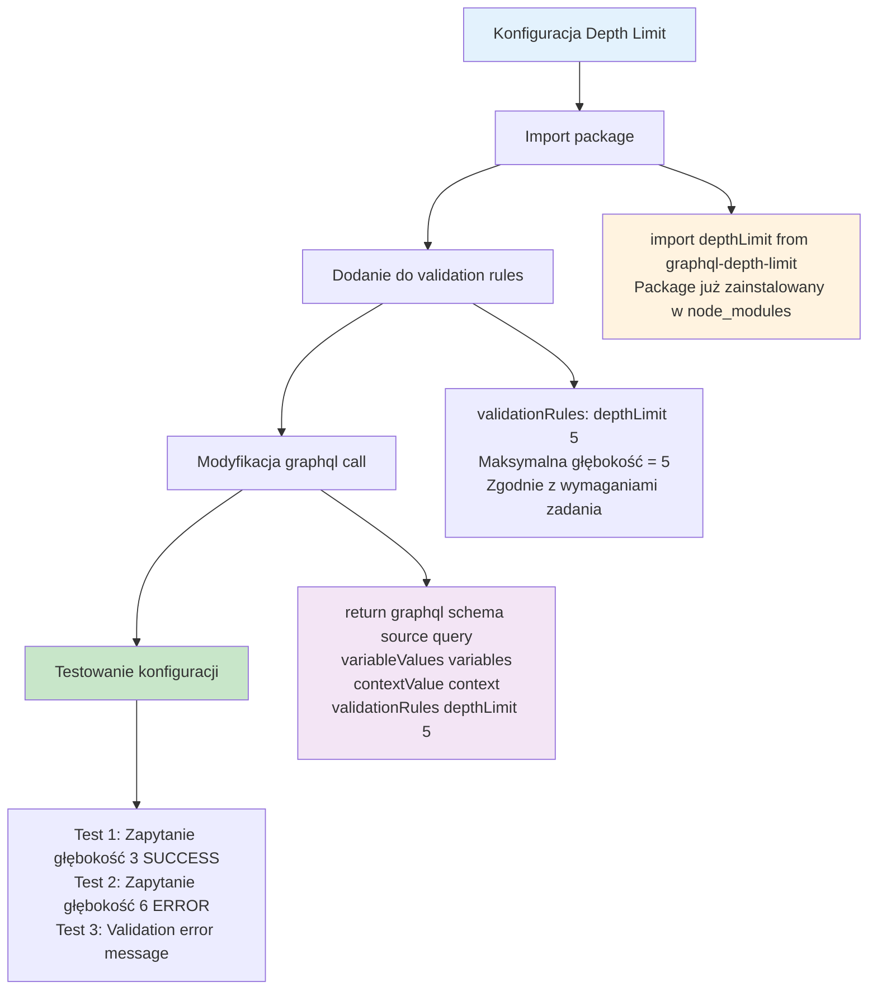

# Etap 3.2: Konfiguracja graphql-depth-limit



## Szczegółowa implementacja:

### 1. Import Statement
```typescript
import depthLimit from 'graphql-depth-limit';
```
- **Package**: graphql-depth-limit (już w dependencies)
- **Type**: Default import
- **Function**: depthLimit(maxDepth: number)

### 2. Validation Rules Configuration
```typescript
validationRules: [depthLimit(5)]
```
- **Array**: validationRules przyjmuje array of validation functions
- **Depth**: 5 (zgodnie z wymaganiami)
- **Execution**: Validation przed query execution

### 3. GraphQL Execution Update
**Przed:**
```typescript
return graphql({
  schema,
  source: query,
  variableValues: variables,
  contextValue: context,
});
```

**Po:**
```typescript
return graphql({
  schema,
  source: query,
  variableValues: variables,
  contextValue: context,
  validationRules: [depthLimit(5)],
});
```

### 4. Jak działa depth limit:
1. **Parse**: GraphQL parsuje query do AST
2. **Validate**: depthLimit analizuje AST i liczy głębokość
3. **Check**: Jeśli głębokość > 5, zwraca validation error
4. **Execute**: Tylko jeśli validation passes

### 5. Error Response Format:
```json
{
  "errors": [
    {
      "message": "Query exceeded maximum depth of 5",
      "locations": [...],
      "path": [...]
    }
  ]
}
```

### 6. Performance Benefits:
- **Early rejection**: Zapytania są odrzucane przed execution
- **DoS protection**: Zapobiega bardzo głębokim zapytaniom
- **Resource saving**: Nie wykonuje kosztownych operacji DB

**Cel**: Minimalna konfiguracja depth limit zgodna z wymaganiami