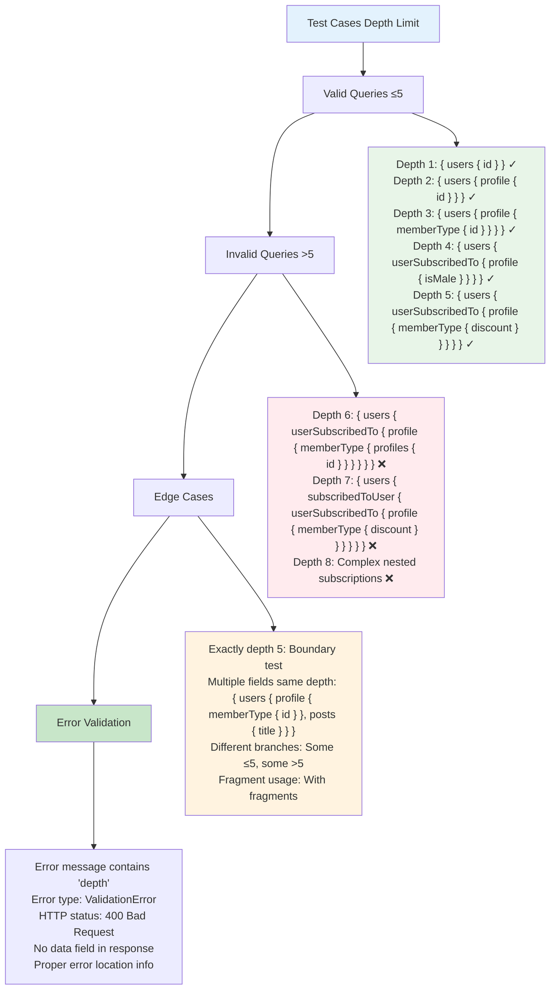

# Etap 3.3: Test Cases dla Depth Limit



## Szczegółowe test cases:

### 1. Valid Queries (Depth ≤ 5)

**Depth 1:**
```graphql
query {
  users { id name balance }
  posts { id title }
  memberTypes { id }
}
```

**Depth 2:**
```graphql
query {
  users {
    profile { id }
    posts { title }
  }
}
```

**Depth 3:**
```graphql
query {
  users {
    profile {
      memberType { id discount }
    }
    userSubscribedTo { name }
  }
}
```

**Depth 4:**
```graphql
query {
  users {
    userSubscribedTo {
      profile { isMale yearOfBirth }
    }
  }
}
```

**Depth 5 (maksymalny):**
```graphql
query {
  users {
    userSubscribedTo {
      profile {
        memberType { discount postsLimitPerMonth }
      }
    }
  }
}
```

### 2. Invalid Queries (Depth > 5)

**Depth 6:**
```graphql
query {
  users {
    userSubscribedTo {
      profile {
        memberType {
          profiles { id }  # 6th level
        }
      }
    }
  }
}
```

**Depth 7:**
```graphql
query {
  users {
    subscribedToUser {
      userSubscribedTo {
        profile {
          memberType {
            profiles { user { id } }  # 7th level
          }
        }
      }
    }
  }
}
```

### 3. Edge Cases

**Multiple branches (mixed depths):**
```graphql
query {
  users {
    profile { memberType { id } }  # Depth 3 ✓
    userSubscribedTo {
      profile {
        memberType {
          profiles { id }  # Depth 6 ❌
        }
      }
    }
  }
}
# Result: ERROR (najgłębsza ścieżka > 5)
```

**Exactly depth 5:**
```graphql
query {
  users {
    profile {
      memberType {
        profiles {
          isMale  # Exactly depth 5 ✓
        }
      }
    }
  }
}
```

### 4. Expected Error Response

```json
{
  "errors": [
    {
      "message": "Query exceeded maximum depth of 5",
      "locations": [
        {
          "line": 2,
          "column": 3
        }
      ]
    }
  ]
}
```

### 5. Test Command
```bash
npm run test-rule
```
- **Test file**: `test/routes/gql-rule.test.js`
- **Validates**: Depth limit functionality
- **Checks**: Both valid and invalid queries

**Cel**: Komprehensywne testowanie depth limit functionality