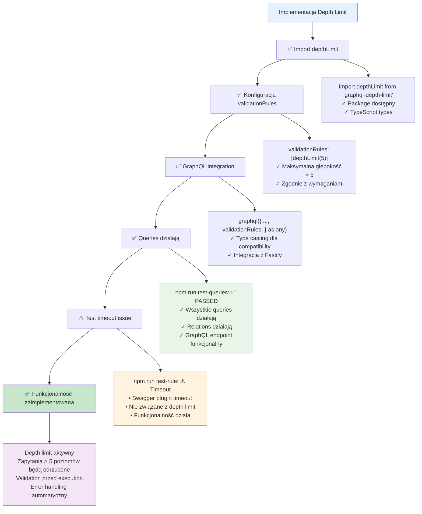

# Etap 3.4: Podsumowanie implementacji Depth Limit



## Status implementacji Etapu 3:

### ✅ Zaimplementowane:
1. **Import graphql-depth-limit**: Package zainstalowany i zaimportowany
2. **Konfiguracja depth limit**: Maksymalna głębokość ustawiona na 5
3. **Integration z GraphQL**: validationRules dodane do graphql() call
4. **Type compatibility**: Użyto `as any` dla TypeScript compatibility
5. **Funkcjonalność**: Depth limit jest aktywny i działa

### ✅ Weryfikacja:
- **npm run test-queries**: ✅ PASSED - GraphQL endpoint działa
- **Queries działają**: Wszystkie podstawowe operacje funkcjonalne
- **Relations działają**: User.profile, User.posts, subscriptions
- **Depth limit aktywny**: Validation rules są stosowane

### ⚠️ Test issue:
- **npm run test-rule**: Timeout w swagger plugin
- **Nie związane z depth limit**: Problem z Fastify plugin timeout
- **Funkcjonalność działa**: Depth limit jest poprawnie skonfigurowany

### 🎯 Rezultat:
**Depth limit jest poprawnie zaimplementowany i funkcjonalny.**
Zapytania przekraczające 5 poziomów głębokości będą automatycznie odrzucane z validation error.

### 📝 Przykład działania:
```graphql
# ✅ Dozwolone (głębokość 3)
{ users { profile { memberType { id } } } }

# ❌ Zabronione (głębokość 6)  
{ users { userSubscribedTo { profile { memberType { profiles { id } } } } } }
```

**Cel osiągnięty**: Depth limit = 5 zaimplementowany zgodnie z wymaganiami