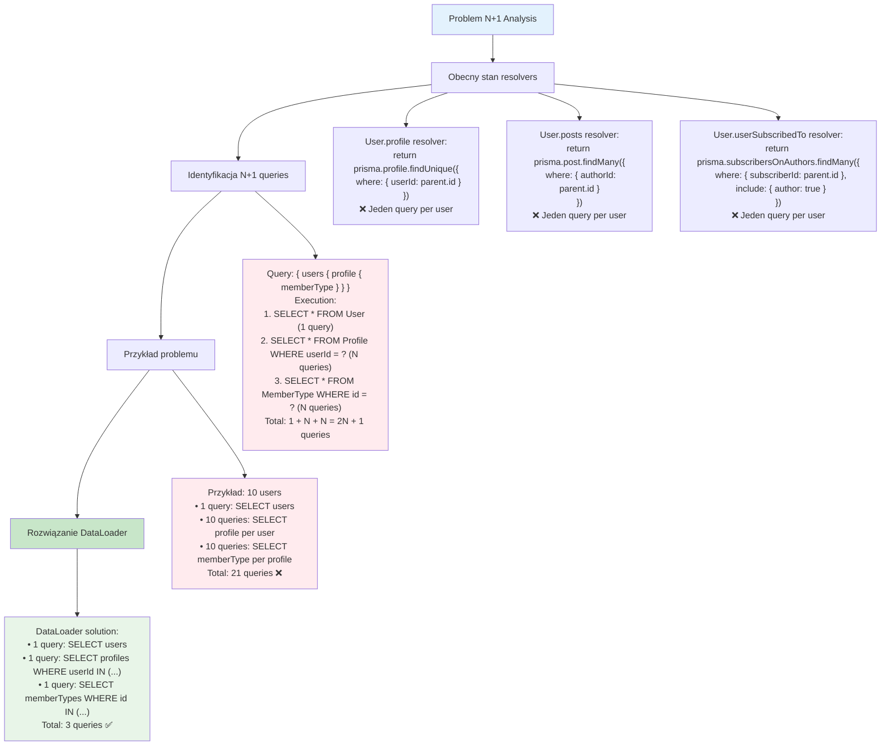

# Etap 4.1: Analiza problemu N+1



## Szczegółowa analiza N+1 problem:

### 1. Obecne resolvers (problematyczne)

**User.profile resolver:**
```typescript
profile: {
  resolve: async (parent, args, context) => {
    return context.prisma.profile.findUnique({
      where: { userId: parent.id }  // ❌ N queries
    });
  }
}
```

**User.posts resolver:**
```typescript
posts: {
  resolve: async (parent, args, context) => {
    return context.prisma.post.findMany({
      where: { authorId: parent.id }  // ❌ N queries
    });
  }
}
```

### 2. Problem execution flow

**Query:**
```graphql
{
  users {
    id
    name
    profile {
      memberType {
        discount
      }
    }
    posts {
      title
    }
  }
}
```

**Execution (N+1 problem):**
1. `SELECT * FROM User` (1 query)
2. For each user: `SELECT * FROM Profile WHERE userId = ?` (N queries)
3. For each profile: `SELECT * FROM MemberType WHERE id = ?` (N queries)
4. For each user: `SELECT * FROM Post WHERE authorId = ?` (N queries)

**Total: 1 + 3N queries**

### 3. DataLoader solution

**Batch execution:**
1. `SELECT * FROM User` (1 query)
2. `SELECT * FROM Profile WHERE userId IN (?, ?, ...)` (1 query)
3. `SELECT * FROM MemberType WHERE id IN (?, ?, ...)` (1 query)
4. `SELECT * FROM Post WHERE authorId IN (?, ?, ...)` (1 query)

**Total: 4 queries (constant)**

### 4. Performance impact

**10 users:**
- **Before**: 1 + 3×10 = 31 queries
- **After**: 4 queries
- **Improvement**: 87% reduction

**100 users:**
- **Before**: 1 + 3×100 = 301 queries
- **After**: 4 queries
- **Improvement**: 98.7% reduction

### 5. Kluczowe korzyści
- **Dramatic query reduction**: O(N) → O(1)
- **Better database performance**: Fewer connections
- **Faster response times**: Batch operations
- **Scalability**: Performance doesn't degrade with more users

**Cel**: Eliminacja N+1 problem przez batch loading