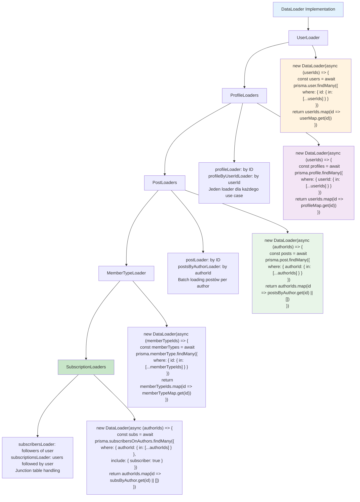

# Etap 4.2: Implementacja DataLoaders



## Szczegółowa implementacja DataLoaders:

### 1. UserLoader
```typescript
const userLoader = new DataLoader(async (userIds: readonly string[]) => {
  const users = await prisma.user.findMany({
    where: { id: { in: [...userIds] } }
  });
  
  const userMap = new Map(users.map(user => [user.id, user]));
  return userIds.map(id => userMap.get(id) || null);
});
```

### 2. ProfileLoaders (2 variants)

**By Profile ID:**
```typescript
const profileLoader = new DataLoader(async (profileIds: readonly string[]) => {
  const profiles = await prisma.profile.findMany({
    where: { id: { in: [...profileIds] } }
  });
  
  const profileMap = new Map(profiles.map(profile => [profile.id, profile]));
  return profileIds.map(id => profileMap.get(id) || null);
});
```

**By User ID:**
```typescript
const profileByUserIdLoader = new DataLoader(async (userIds: readonly string[]) => {
  const profiles = await prisma.profile.findMany({
    where: { userId: { in: [...userIds] } }
  });
  
  const profileMap = new Map(profiles.map(profile => [profile.userId, profile]));
  return userIds.map(id => profileMap.get(id) || null);
});
```

### 3. PostLoaders (2 variants)

**By Post ID:**
```typescript
const postLoader = new DataLoader(async (postIds: readonly string[]) => {
  const posts = await prisma.post.findMany({
    where: { id: { in: [...postIds] } }
  });
  
  const postMap = new Map(posts.map(post => [post.id, post]));
  return postIds.map(id => postMap.get(id) || null);
});
```

**By Author ID (1:N relation):**
```typescript
const postsByAuthorLoader = new DataLoader(async (authorIds: readonly string[]) => {
  const posts = await prisma.post.findMany({
    where: { authorId: { in: [...authorIds] } }
  });
  
  const postsByAuthor = new Map<string, any[]>();
  authorIds.forEach(id => postsByAuthor.set(id, []));
  
  posts.forEach(post => {
    const authorPosts = postsByAuthor.get(post.authorId) || [];
    authorPosts.push(post);
    postsByAuthor.set(post.authorId, authorPosts);
  });
  
  return authorIds.map(id => postsByAuthor.get(id) || []);
});
```

### 4. MemberTypeLoader
```typescript
const memberTypeLoader = new DataLoader(async (memberTypeIds: readonly string[]) => {
  const memberTypes = await prisma.memberType.findMany({
    where: { id: { in: [...memberTypeIds] } }
  });
  
  const memberTypeMap = new Map(memberTypes.map(mt => [mt.id, mt]));
  return memberTypeIds.map(id => memberTypeMap.get(id) || null);
});
```

### 5. SubscriptionLoaders (N:N relations)

**Subscribers (followers of user):**
```typescript
const subscribersLoader = new DataLoader(async (authorIds: readonly string[]) => {
  const subscriptions = await prisma.subscribersOnAuthors.findMany({
    where: { authorId: { in: [...authorIds] } },
    include: { subscriber: true }
  });
  
  const subscribersByAuthor = new Map<string, any[]>();
  authorIds.forEach(id => subscribersByAuthor.set(id, []));
  
  subscriptions.forEach(sub => {
    const authorSubs = subscribersByAuthor.get(sub.authorId) || [];
    authorSubs.push(sub.subscriber);
    subscribersByAuthor.set(sub.authorId, authorSubs);
  });
  
  return authorIds.map(id => subscribersByAuthor.get(id) || []);
});
```

### 6. Kluczowe wzorce
- **Single findMany**: Jeden call per loader
- **Map creation**: Efficient lookup structure
- **Null handling**: Return null for missing items
- **Array handling**: Empty arrays for 1:N relations
- **Include usage**: For junction tables

**Cel**: Efficient batch loading dla wszystkich typów relacji