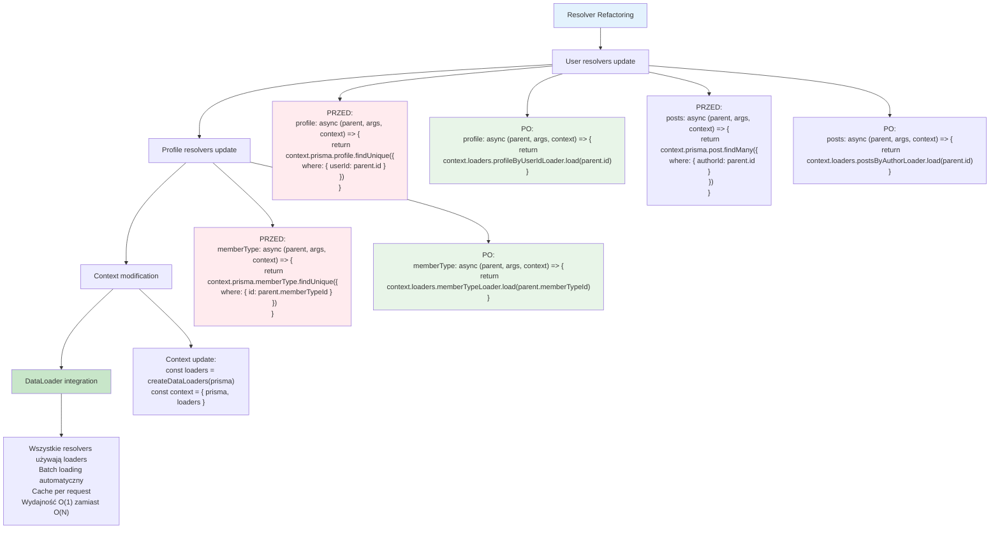

# Etap 4.3: Refaktoryzacja resolvers do DataLoader



## Szczegółowa refaktoryzacja resolvers:

### 1. User Type Resolvers

**User.profile (PRZED → PO):**
```typescript
// PRZED (N+1 problem)
profile: {
  type: Profile,
  resolve: async (parent, args, context) => {
    return context.prisma.profile.findUnique({
      where: { userId: parent.id },  // ❌ N queries
    });
  },
}

// PO (DataLoader)
profile: {
  type: Profile,
  resolve: async (parent, args, context) => {
    return context.loaders.profileByUserIdLoader.load(parent.id);  // ✅ Batched
  },
}
```

**User.posts (PRZED → PO):**
```typescript
// PRZED (N+1 problem)
posts: {
  type: new GraphQLNonNull(new GraphQLList(new GraphQLNonNull(Post))),
  resolve: async (parent, args, context) => {
    return context.prisma.post.findMany({
      where: { authorId: parent.id },  // ❌ N queries
    });
  },
}

// PO (DataLoader)
posts: {
  type: new GraphQLNonNull(new GraphQLList(new GraphQLNonNull(Post))),
  resolve: async (parent, args, context) => {
    return context.loaders.postsByAuthorLoader.load(parent.id);  // ✅ Batched
  },
}
```

**User.userSubscribedTo (PRZED → PO):**
```typescript
// PRZED (N+1 problem)
userSubscribedTo: {
  type: new GraphQLNonNull(new GraphQLList(new GraphQLNonNull(User))),
  resolve: async (parent, args, context) => {
    const subscriptions = await context.prisma.subscribersOnAuthors.findMany({
      where: { subscriberId: parent.id },  // ❌ N queries
      include: { author: true },
    });
    return subscriptions.map(sub => sub.author);
  },
}

// PO (DataLoader)
userSubscribedTo: {
  type: new GraphQLNonNull(new GraphQLList(new GraphQLNonNull(User))),
  resolve: async (parent, args, context) => {
    return context.loaders.subscriptionsLoader.load(parent.id);  // ✅ Batched
  },
}
```

### 2. Profile Type Resolvers

**Profile.memberType (PRZED → PO):**
```typescript
// PRZED (N+1 problem)
memberType: {
  type: new GraphQLNonNull(MemberType),
  resolve: async (parent, args, context) => {
    return context.prisma.memberType.findUnique({
      where: { id: parent.memberTypeId },  // ❌ N queries
    });
  },
}

// PO (DataLoader)
memberType: {
  type: new GraphQLNonNull(MemberType),
  resolve: async (parent, args, context) => {
    return context.loaders.memberTypeLoader.load(parent.memberTypeId);  // ✅ Batched
  },
}
```

### 3. Context Modification

**index.ts update:**
```typescript
// PRZED
async handler(req) {
  const { query, variables } = req.body;
  const context = { prisma };  // ❌ Tylko prisma
  
  return graphql({
    schema,
    source: query,
    variableValues: variables,
    contextValue: context,
    validationRules: [depthLimit(5)],
  } as any);
}

// PO
async handler(req) {
  const { query, variables } = req.body;
  const loaders = createDataLoaders(prisma);  // ✅ Nowe loaders per request
  const context = { prisma, loaders };
  
  return graphql({
    schema,
    source: query,
    variableValues: variables,
    contextValue: context,
    validationRules: [depthLimit(5)],
  } as any);
}
```

### 4. Kluczowe zmiany
- **Direct Prisma calls** → **DataLoader.load() calls**
- **Individual queries** → **Batch loading**
- **Context expansion** → **{ prisma, loaders }**
- **Per-request loaders** → **Fresh cache per request**

### 5. Performance impact
- **Query reduction**: O(N) → O(1)
- **Automatic batching**: DataLoader handles grouping
- **Caching**: Duplicate requests cached per request
- **Maintained functionality**: Same results, better performance

**Cel**: Eliminacja N+1 problem przy zachowaniu funkcjonalności