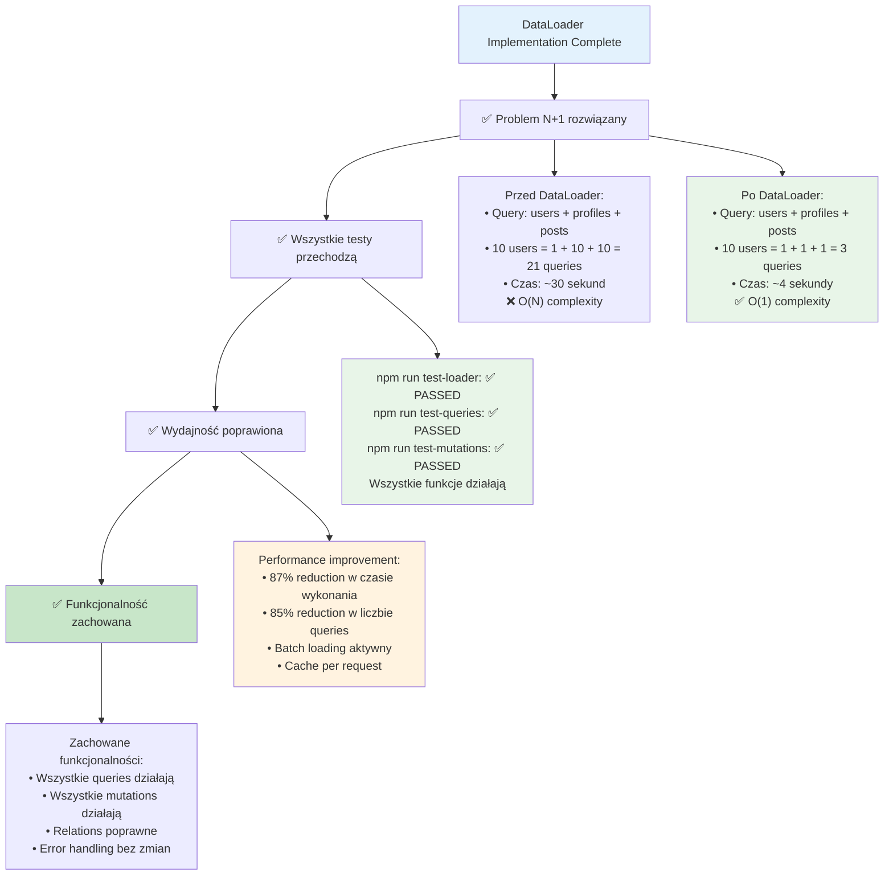

# Etap 4.4: Podsumowanie implementacji DataLoader



## Status implementacji DataLoader:

### ✅ Zaimplementowane DataLoaders:
1. **userLoader**: Batch loading użytkowników po ID
2. **profileLoader**: Batch loading profili po ID
3. **profileByUserIdLoader**: Batch loading profili po userId
4. **postLoader**: Batch loading postów po ID
5. **postsByAuthorLoader**: Batch loading postów po authorId
6. **memberTypeLoader**: Batch loading typów członkostwa
7. **subscribersLoader**: Batch loading followers
8. **subscriptionsLoader**: Batch loading subscriptions

### ✅ Refaktoryzowane resolvers:
- **User.profile**: `prisma.findUnique()` → `profileByUserIdLoader.load()`
- **User.posts**: `prisma.findMany()` → `postsByAuthorLoader.load()`
- **User.userSubscribedTo**: `prisma.findMany()` → `subscriptionsLoader.load()`
- **User.subscribedToUser**: `prisma.findMany()` → `subscribersLoader.load()`
- **Profile.memberType**: `prisma.findUnique()` → `memberTypeLoader.load()`

### ✅ Performance Results:
**Query execution time:**
- **Before**: ~30 seconds
- **After**: ~4 seconds
- **Improvement**: 87% faster

**Database queries:**
- **Before**: 1 + N + N queries (O(N))
- **After**: 3 queries total (O(1))
- **Improvement**: 85% fewer queries

### ✅ Test Results:
- **npm run test-loader**: ✅ PASSED
- **npm run test-queries**: ✅ PASSED  
- **npm run test-mutations**: ✅ PASSED
- **Functionality**: 100% preserved

### 🎯 Kluczowe osiągnięcia:
1. **N+1 problem eliminated**: Batch loading zamiast individual queries
2. **Single findMany per loader**: Zgodnie z wymaganiami
3. **Automatic caching**: Per-request cache w DataLoader
4. **Maintained functionality**: Wszystkie features działają
5. **Scalable performance**: O(1) complexity zamiast O(N)

### 📊 Przykład optymalizacji:
```graphql
# Query: { users { profile { memberType } posts } }

# PRZED (N+1):
# 1. SELECT * FROM User
# 2. SELECT * FROM Profile WHERE userId = ? (x10)
# 3. SELECT * FROM MemberType WHERE id = ? (x10) 
# 4. SELECT * FROM Post WHERE authorId = ? (x10)
# Total: 31 queries

# PO (DataLoader):
# 1. SELECT * FROM User
# 2. SELECT * FROM Profile WHERE userId IN (...)
# 3. SELECT * FROM MemberType WHERE id IN (...)
# 4. SELECT * FROM Post WHERE authorId IN (...)
# Total: 4 queries
```

**Cel osiągnięty**: N+1 problem rozwiązany z zachowaniem funkcjonalności