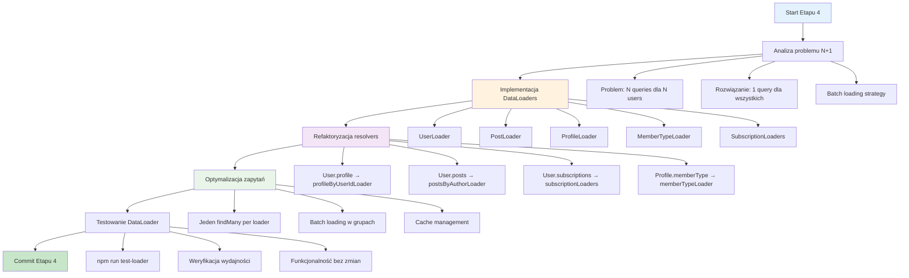

# Etap 4: Implementacja DataLoader dla rozwiązania problemu N+1

## Kluczowe komponenty Etapu 4:

### 1. Problem N+1
- **Obecny stan**: Każdy User w liście triggeruje osobne queries dla profile/posts
- **Przykład**: 10 users → 1 query users + 10 queries profiles + 10 queries posts = 21 queries
- **Cel**: 10 users → 1 query users + 1 query profiles + 1 query posts = 3 queries

### 2. DataLoader Implementation
- **UserLoader**: Batch loading użytkowników po ID
- **ProfileLoader**: Batch loading profili po ID i userId
- **PostLoader**: Batch loading postów po ID i authorId
- **MemberTypeLoader**: Batch loading typów członkostwa
- **SubscriptionLoaders**: Batch loading subscriptions

### 3. Batch Loading Strategy
- **Collect**: Zbieranie wszystkich requested IDs
- **Batch**: Jeden findMany call z wszystkimi IDs
- **Distribute**: Mapowanie wyników do original requests
- **Cache**: Automatyczne cache dla duplicate requests

### 4. Wymagania
- Jeden findMany call per loader
- Zachowanie funkcjonalności
- Poprawa wydajności
- DataLoader package (już zainstalowany)