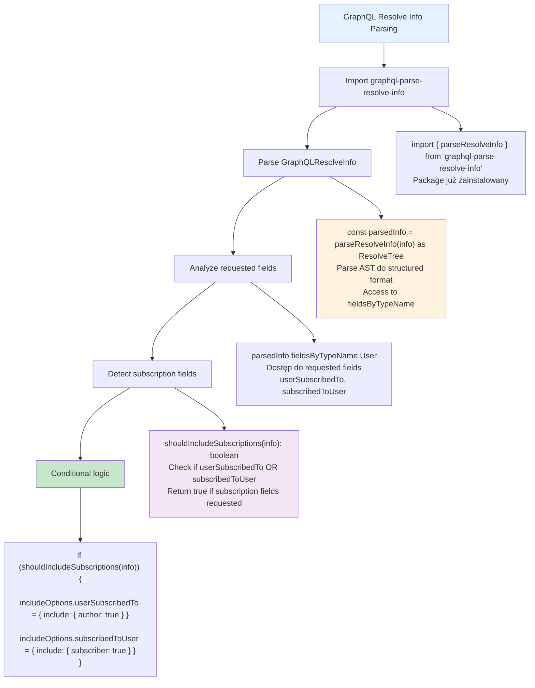

# Etap 5.1: GraphQL Resolve Info Parsing



## Szczegółowa implementacja resolve info parsing:

### 1. GraphQL Resolve Info Structure
```typescript
interface GraphQLResolveInfo {
  fieldName: string;
  fieldNodes: FieldNode[];
  returnType: GraphQLOutputType;
  parentType: GraphQLObjectType;
  path: Path;
  schema: GraphQLSchema;
  fragments: FragmentMap;
  rootValue: any;
  operation: OperationDefinitionNode;
  variableValues: { [key: string]: any };
}
```

### 2. Parse Resolve Info Usage
```typescript
import { parseResolveInfo, ResolveTree } from 'graphql-parse-resolve-info';

const shouldIncludeSubscriptions = (info: GraphQLResolveInfo): boolean => {
  const parsedInfo = parseResolveInfo(info) as ResolveTree;
  
  if (!parsedInfo || !parsedInfo.fieldsByTypeName) {
    return false;
  }

  const userFields = parsedInfo.fieldsByTypeName.User;
  if (!userFields) {
    return false;
  }

  return !!(userFields.userSubscribedTo || userFields.subscribedToUser);
};
```

### 3. Query Analysis Examples

**Query WITH subscriptions:**
```graphql
{
  users {
    id
    name
    userSubscribedTo {  # ← Detected
      name
    }
  }
}
```
**Result**: `shouldIncludeSubscriptions() = true`

**Query WITHOUT subscriptions:**
```graphql
{
  users {
    id
    name
    profile {
      memberType {
        discount
      }
    }
  }
}
```
**Result**: `shouldIncludeSubscriptions() = false`

### 4. Conditional Include Logic
```typescript
const includeOptions: any = {
  profile: {
    include: {
      memberType: true,
    },
  },
  posts: true,
};

if (shouldIncludeSubscriptions(info)) {
  includeOptions.userSubscribedTo = {
    include: { author: true },
  };
  includeOptions.subscribedToUser = {
    include: { subscriber: true },
  };
}
```

### 5. Performance Benefits
- **Smart loading**: Subscriptions tylko gdy requested
- **Reduced joins**: Unikanie niepotrzebnych includes
- **Faster queries**: Mniejsze result sets gdy subscriptions nie są potrzebne
- **Conditional optimization**: Query tailored to actual needs

### 6. ResolveTree Structure
```typescript
interface ResolveTree {
  name: string;
  alias: string;
  args: { [key: string]: any };
  fieldsByTypeName: {
    [typeName: string]: {
      [fieldName: string]: ResolveTree;
    };
  };
}
```

**Cel**: Intelligent field detection dla conditional loading