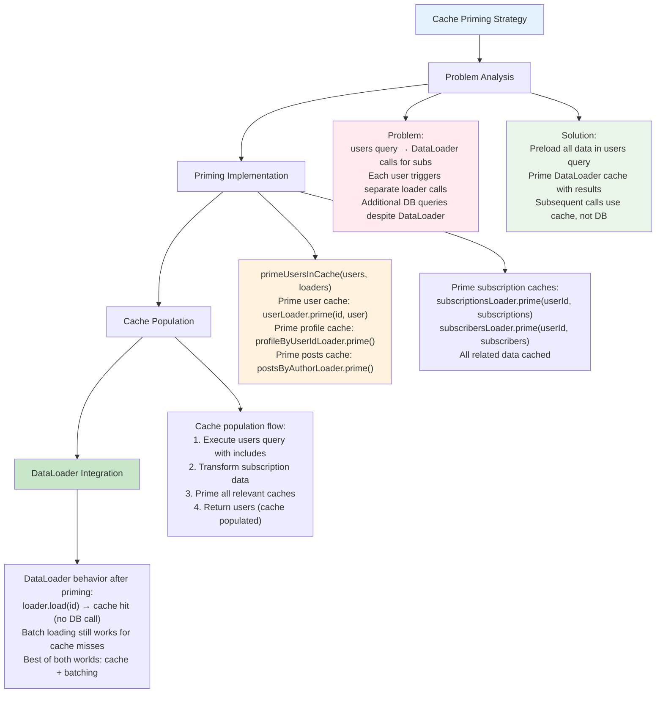

# Etap 5.2: Cache Priming Strategy



## Szczegółowa cache priming strategy:

### 1. Problem bez cache priming
```typescript
// Query: { users { userSubscribedTo { name } } }

// Execution flow:
// 1. users query → returns 10 users
// 2. User.userSubscribedTo resolver calls subscriptionsLoader.load() for each user
// 3. DataLoader batches these calls → 1 DB query for subscriptions
// 4. Total: 2 DB queries (users + subscriptions)
```

### 2. Solution z cache priming
```typescript
// Query: { users { userSubscribedTo { name } } }

// Execution flow:
// 1. users query with conditional includes → returns users + subscriptions
// 2. Prime cache with loaded data
// 3. User.userSubscribedTo resolver calls subscriptionsLoader.load()
// 4. DataLoader returns from cache (no DB call)
// 5. Total: 1 DB query (users with includes)
```

### 3. Cache Priming Implementation
```typescript
const primeUsersInCache = async (users: any[], loaders: any) => {
  // Prime user cache
  users.forEach(user => {
    loaders.userLoader.prime(user.id, user);
  });

  // Prime profile cache if profiles are included
  const profiles = users.filter(user => user.profile).map(user => user.profile);
  profiles.forEach(profile => {
    loaders.profileLoader.prime(profile.id, profile);
    loaders.profileByUserIdLoader.prime(profile.userId, profile);
  });

  // Prime posts cache if posts are included
  const allPosts = users.flatMap(user => user.posts || []);
  allPosts.forEach(post => {
    loaders.postLoader.prime(post.id, post);
  });

  // Prime posts by author cache
  users.forEach(user => {
    if (user.posts) {
      loaders.postsByAuthorLoader.prime(user.id, user.posts);
    }
  });

  // Prime subscription caches if subscriptions are included
  users.forEach(user => {
    if (user.userSubscribedTo) {
      loaders.subscriptionsLoader.prime(user.id, user.userSubscribedTo);
    }
    if (user.subscribedToUser) {
      loaders.subscribersLoader.prime(user.id, user.subscribedToUser);
    }
  });
};
```

### 4. Users Query z Cache Priming
```typescript
users: {
  type: new GraphQLNonNull(new GraphQLList(new GraphQLNonNull(User))),
  resolve: async (parent, args, context, info) => {
    const includeSubscriptions = shouldIncludeSubscriptions(info);
    
    const includeOptions: any = {
      profile: {
        include: {
          memberType: true,
        },
      },
      posts: true,
    };
    
    if (includeSubscriptions) {
      includeOptions.userSubscribedTo = {
        include: { author: true },
      };
      includeOptions.subscribedToUser = {
        include: { subscriber: true },
      };
    }
    
    const users = await context.prisma.user.findMany({
      include: includeOptions,
    });
    
    // Transform subscription data
    const transformedUsers = users.map(user => ({
      ...user,
      userSubscribedTo: user.userSubscribedTo?.map((sub: any) => sub.author) || [],
      subscribedToUser: user.subscribedToUser?.map((sub: any) => sub.subscriber) || [],
    }));
    
    // Prime cache with loaded data
    await primeUsersInCache(transformedUsers, context.loaders);
    
    return transformedUsers;
  },
}
```

### 5. Performance Benefits
- **Query reduction**: 2 queries → 1 query
- **Cache efficiency**: Subsequent calls use cache
- **Smart loading**: Conditional includes based on requested fields
- **Zero redundancy**: No duplicate DB calls

### 6. Cache Behavior
- **Cache hit**: `loader.load(id)` returns immediately from cache
- **Cache miss**: `loader.load(id)` falls back to batch loading
- **Per-request**: Fresh cache per GraphQL request
- **Automatic**: No manual cache management needed

**Cel**: Optimal performance przez intelligent cache priming