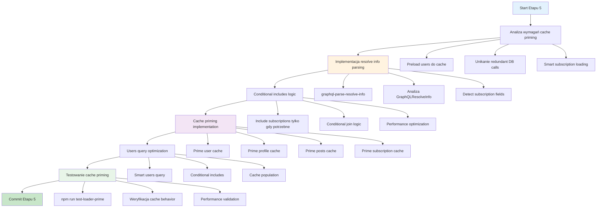

# Etap 5: Cache Priming i finalne optymalizacje

## Kluczowe komponenty Etapu 5:

### 1. Cache Priming Strategy
- **Problem**: Users query triggeruje DataLoader calls dla subs
- **Rozwiązanie**: Preload wszystkich users do cache
- **Benefit**: Zero dodatkowych DB calls dla subscriptions

### 2. Conditional Includes
- **graphql-parse-resolve-info**: Analiza requested fields
- **Smart loading**: Include subscriptions tylko gdy requested
- **Performance**: Unikanie niepotrzebnych joins

### 3. Implementation Steps
1. Parse GraphQLResolveInfo w users query
2. Detect czy subscriptions są requested
3. Conditional include subscriptions w Prisma query
4. Prime cache z loaded data
5. DataLoaders używają cache zamiast DB

### 4. Expected Results
- **npm run test-loader-prime**: ✅ PASSED
- **Zero redundant queries**: Cache hits zamiast DB calls
- **Smart loading**: Subscriptions tylko gdy potrzebne
- **Performance**: Optimal query execution